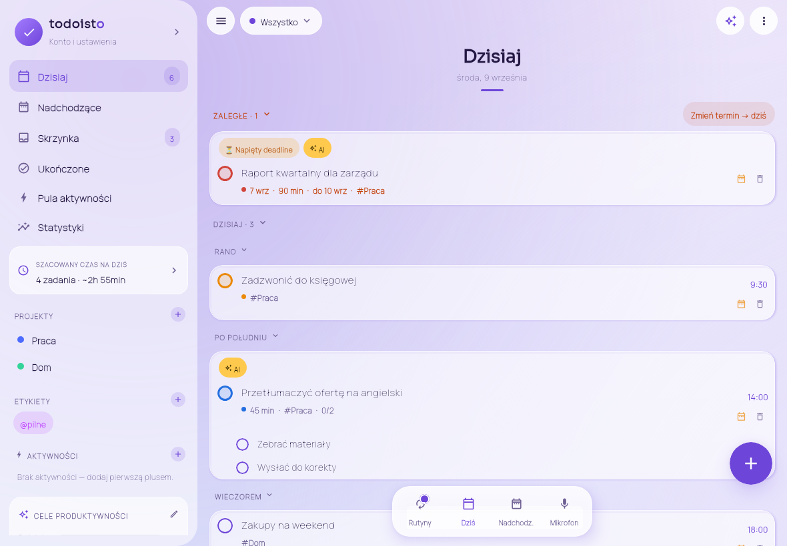

# Todoisto na macOS (Compose Multiplatform — Desktop)

Natywna wersja Todoisto na Maca, zbudowana na **Compose for Desktop** (to samo
Compose UI i ten sam Kotlin co w wersji Android). Uruchamia się jako natywne okno
macOS (własna ikona w Docku, powiadomienia, skróty ⌘) i pakuje do `.dmg` / `.pkg`.

> **Status: pełna funkcjonalność Androida.** Interfejs jest przeniesiony 1:1 z
> telefonu (menu boczne = szuflada, pasek górny ☰ · Obszar · ✦ · ⋮, dock
> Rutyny / Dziś / Nadchodz. / Mikrofon, FAB z panelem „Nowe zadanie", sekcje
> ZALEGŁE / DZISIAJ z kubełkami Rano / Po południu / Wieczorem, szczegóły
> zadania ze zwijanymi wierszami i bąblem AI, Ustawienia / Konto / Statystyki).
> Dane latają Mac ↔ telefon przez Supabase (zadania, projekty, sekcje, etykiety,
> obszary, aktywności).



## Wymagania (Mac)

- **JDK 17** — `brew install --cask temurin@17`
- Repo sklonowane (`git clone -b claude/android-todoist-app-ea5o7s …`)

Nie potrzebujesz Android Studio do wersji desktopowej — wystarczy JDK.

## Uruchomienie

Najprościej: w Finderze kliknij dwukrotnie **`Todoisto.command`**. Albo w Terminalu:

```bash
./gradlew :desktop:run
```

Aktualizacja do najnowszej wersji (dane i ustawienia zostają):

```bash
cd ~/todoisto && git pull && ./gradlew :desktop:run
```

> Jeśli `./gradlew` marudzi o Javie: `export JAVA_HOME=$(/usr/libexec/java_home -v 17)`

## Zbudowanie natywnej paczki `.dmg`

```bash
./gradlew :desktop:packageDmg
# wynik: desktop/build/compose/binaries/main/dmg/Todoisto-1.0.0.dmg
./gradlew :desktop:createDistributable   # gotowy .app → desktop/build/compose/binaries/main/app/Todoisto.app
```

`.dmg`/`.pkg` da się zbudować **tylko na macOS**. Ikona `.app` to `desktop/icons/Todoisto.icns`
(ta sama grafika co ikona Androida). Aby paczka nie była blokowana przez Gatekeeper u innych
użytkowników, trzeba ją podpisać certyfikatem Apple Developer (osobny, opcjonalny krok).

## Jak to jest ułożone w oknie (mapowanie z Androida)

| Android | Mac |
|---|---|
| Szuflada (☰) | **Menu boczne** po lewej — te same wiersze: Konto i ustawienia, Dzisiaj, Nadchodzące, Skrzynka, Ukończone, Pula aktywności, Statystyki, Szacowany czas na dziś, ★ Ulubione, Projekty (+), Etykiety (+), Aktywności (+), Archiwum, Cele produktywności. Chowasz/pokazujesz przyciskiem ☰ lub ⌘B. |
| Pasek górny | Ten sam: ☰ · przełącznik **obszaru** („Wszystko" / obszary / + Nowy obszar) · ✦ **Asystent tygodnia** · ⋮ menu (Sortowanie, Skanuj kartkę, Czas wolny, Kopiuj plan dnia; w projekcie: ulubione, Dodaj sekcję, Duplikuj, Archiwizuj, Usuń; w etykiecie: ulubione, Usuń). |
| Dock na dole | Ten sam: **Rutyny** (badge + pierścień postępu dnia) · **Dziś** · **Nadchodz.** · **Mikrofon**. |
| FAB „+" | Ten sam — otwiera panel **Nowe zadanie** (parser języka naturalnego, chipy rozpoznanych tokenów, skróty, skan z pliku). ⌘N robi to samo. **Enter dodaje zadanie.** |
| Przesunięcie kafelka (Ukończ / Na jutro) | Kółko = ukończ; ikona kalendarza = **Termin** (Dziś / Jutro / Następny weekend / kalendarz / Zapisz); kosz = usuń. Przy zaległych dodatkowo „Zmień termin → dziś" (jak w Todoist). |
| Mikrofon (rozpoznawanie mowy) | Otwiera „Nowe zadanie" z kursorem w polu i podpowiedzią: **dyktowanie macOS** (dwa razy 🎤/fn) wpisuje tekst, Enter dodaje. |
| Skan aparatem / z galerii | „Skanuj kartkę" → wybór **pliku ze zdjęciem** (AI-wizja z tym samym promptem co na telefonie). Zdjęcie robisz telefonem (AirDrop/iCloud). |
| Ekrany Ustawienia / Konto / Statystyki | Te same ekrany (pełne okno, „Wróć"). Ustawienia: Konto, Ogólne, Synchronizacja automatyczna, Motyw (6 palet), Tryb ciemny, Tło (gradient / scena wg pory dnia / własne zdjęcia / losuj), Menu boczne, Klucz API (OpenAI), Cele, Pula aktywności, Import z arkusza, Statystyki, Usuń ukończone, O aplikacji. Konto: profil (imię, zdjęcie), motyw, tryb ciemny, **Chmura** (URL/anon → Zaloguj / Załóż konto → Synchronizuj / Wyślij / Pobierz / Wyloguj), **Gmail**, **Zużycie AI** (+ klucz Admin, realny koszt). |
| Splash z logo | Ten sam (gradient + logo + „Todoisto"). |

Skróty: ⌘N nowe zadanie · ⌘S synchronizuj · ⌘, ustawienia · ⌘1–⌘4 widoki · ⌘B menu boczne · Esc zamyka warstwę.

## Struktura

```
desktop/
├── build.gradle.kts                 # Compose Desktop + pakowanie .dmg/.pkg (ikona z icons/)
├── icons/Todoisto.icns              # ikona .app (ta sama grafika co Android)
├── src/main/resources/font/         # Sora + Manrope (jak w Androidzie)
└── src/main/kotlin/pl/media30/todoisto/
    ├── data/                        # przenośne klasy z Androida (parser, AI, Gmail, aktywności, tła)
    ├── ui/theme/ThemePalette.kt     # te same 6 motywów
    └── desktop/
        ├── Main.kt                  # okno, pasek górny, dock, FAB, splash, tło
        ├── State.kt                 # AppState = odpowiednik TodoViewModel (widoki, rutyny, AI, chmura…)
        ├── Model.kt                 # TaskRepository (migawka na dysku), AppSettings, sync/backup/Gmail/CSV
        ├── Drawer.kt                # menu boczne (szuflada)
        ├── TaskList.kt              # lista z sekcjami, kafelki, panel rutyn, Termin, Sortowanie
        ├── QuickAdd.kt              # panel „Nowe zadanie", wybór pliku do skanu
        ├── TaskDetail.kt            # szczegóły zadania + dialogi (obszar/projekt/etykieta/sekcja/cele/klucze)
        ├── Ai.kt                    # Asystent tygodnia, karta AI, Asystent zdjęcia, szacowany czas
        ├── Settings.kt              # Ustawienia, Konto, Statystyki
        ├── Activities.kt            # Pula aktywności, formularz, Czas wolny, import CSV
        └── Components.kt / Theme.kt / AppIcon.kt
```

Testy: `gradle :desktop:test` — `AddTaskTest` (dodawanie zadań od parsera do dysku) i
`RenderPreviewTest`, który renderuje główne ekrany do `desktop/build/previews/*.png`
(bez otwierania okna) — szybka wizualna kontrola po zmianach.

## Synchronizacja z wersją Android (Supabase)

Obie aplikacje piszą ten sam blob JSON do tabeli `todoisto_backups` (wiersz
`{user_id, data}`) przez wspólny moduł `shared`. Synchronizacja = pobierz z chmury →
**scal** z lokalnym (nic nie ginie; przy konflikcie wygrywa nowsza wersja; usunięcia
jako nagrobki) → wyślij. Auto-sync: przy starcie, co 2 min i ~4 s po każdej zmianie
(na telefonie: start / co 3 min / po zmianie).

Konfiguracja (raz): Supabase → New project → SQL Editor:

```sql
create table if not exists public.todoisto_backups (
  user_id uuid primary key references auth.users(id) on delete cascade,
  data jsonb not null,
  updated_at timestamptz default now()
);
alter table public.todoisto_backups enable row level security;
create policy "own select" on public.todoisto_backups for select using (auth.uid() = user_id);
create policy "own insert" on public.todoisto_backups for insert with check (auth.uid() = user_id);
create policy "own update" on public.todoisto_backups for update using (auth.uid() = user_id) with check (auth.uid() = user_id);
```

Authentication → Providers → Email → wyłącz „Confirm email". Project Settings → API →
**Project URL** + **anon public** (nigdy klucz `secret`). Na Macu: menu boczne →
„Konto i ustawienia" → Konto → Chmura: wklej URL i anon, zaloguj **tym samym e-mailem
i hasłem co na telefonie**. Hasło jest zapamiętywane lokalnie (java.util.prefs),
żeby auto-sync działał po restarcie — tak jak sesja na telefonie.

Co się synchronizuje: zadania (z podzadaniami, załącznikami, przypomnieniami),
projekty, sekcje, etykiety, obszary, aktywności. Ustawienia (motyw, klucze, cele) są
lokalne dla każdego urządzenia. Lokalizacja zadania (GPS) zostaje na telefonie.

## Wspólny moduł `shared`

`CloudModels` (CloudTask/Project/Label/Area/Section/Activity/Snapshot), `CloudBackupCodec`
(JSON zgodny bajt-w-bajt z Androidem; nowe tablice są opcjonalne, więc starsze wersje
je ignorują), `SupabaseSync` (signIn/signUp/pull/push), `SnapshotMerge` (scalanie).
Testy: `gradle :shared:test`.

## Roadmap wersji desktop

- ✅ Trwałe dane lokalne (`~/.todoisto/data.json`) + synchronizacja Mac ↔ Android
- ✅ Bezpieczne scalanie, nagrobki, auto-sync po obu stronach
- ✅ Pełny interfejs Androida: menu boczne, pasek górny, dock, FAB, sekcje zwijane, rutyny
- ✅ Szczegóły zadania (AI, priorytet, projekt, termin+godzina, deadline, powtarzanie,
  czas trwania, przypomnienie, etykiety, załączniki, podzadania)
- ✅ Obszary, sekcje projektów, aktywności — w synchronizacji i w UI
- ✅ Ustawienia / Konto / Statystyki 1:1 (motywy, tryb ciemny, tła, cele, klucze AI,
  chmura, Gmail, zużycie AI)
- ✅ AI: Asystent tygodnia, karta AI w zadaniu, skan zdjęcia z pliku, szacunek czasu
- ✅ Ikona aplikacji (okno, Dock, .app), splash, powiadomienia macOS, skróty ⌘
- Podpisanie `.dmg` certyfikatem Apple (opcjonalnie)

## Parytet z wersją Android — co jest, a czego nie

**Nieprzenośne (API tylko Androida):** przypomnienia lokalizacyjne/geofencing i planer
pogodowy (Mac nie ma GPS), rozpoznawanie mowy `SpeechRecognizer` (zastąpione
systemowym dyktowaniem macOS w polu tekstowym), aparat na żywo (zastąpiony wyborem
pliku), przeciąganie kafelków palcem (zastąpione ikonami akcji), dźwięk ukończenia.
Wszystko pozostałe działa tak samo.
